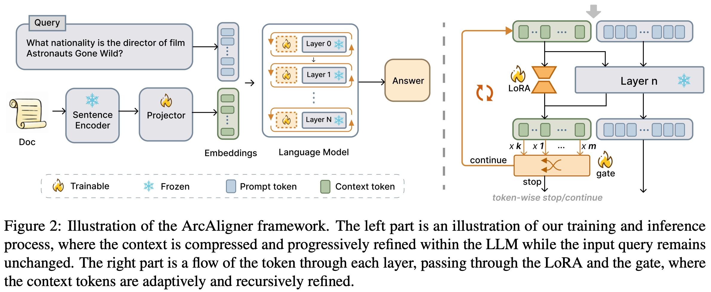

<p align="center">

  <h2 align="center"><strong>ArcAligner: Adaptive Recursive Aligner for Compressed Context Embeddings in RAG </strong></h2>

<p align="center">

  <a href="https://arxiv.org/pdf/2601.05038">
    
  </a>
</p>

<div align="center">
</div>

<div align="center">
  <span class="author">
    Jianbo Li<sup>*</sup>, &ensp;
    <a href="https://github.com/liunian-Jay">Yi Jiang</a><sup>*</sup>, &ensp;
    <a href="https://scholar.google.com/citations?user=ZtIhRvwAAAAJ&hl=zh-CN&oi=sra">Sendong Zhao</a><sup>†</sup>,  &ensp;
    Bairui Hu,  &ensp;
    Haochun Wang,  &ensp;
    Bing Qin &ensp;
  </span>
  
  <br>

  <span class="affiliation">
    Harbin Institute of Technology
  </span>

  <br>

  <span class="note">
    <sup>*</sup>Equal contribution,
    <sup>†</sup>Corresponding author
  </span>
</div>

## 🌞 Introduction
we propose ArcAligner (Adaptive recursive context Aligner), a lightweight module integrated into the language model layers to
help the model better utilize highly compressed context representations for downstream generation. It uses an adaptive “gating” system
that only adds extra processing power when the information is complex, keeping the system fast.

<div align="center">


**Framework**
</div>

## Details will be completed soon!
...TBD...

## Citation
```bibtex
@misc{li2026arcaligneradaptiverecursivealigner,
      title={ArcAligner: Adaptive Recursive Aligner for Compressed Context Embeddings in RAG}, 
      author={Jianbo Li and Yi Jiang and Sendong Zhao and Bairui Hu and Haochun Wang and Bing Qin},
      year={2026},
      eprint={2601.05038},
      archivePrefix={arXiv},
      primaryClass={cs.CL},
      url={https://arxiv.org/abs/2601.05038}, 
}
```

Thanks for your interest in our work!
